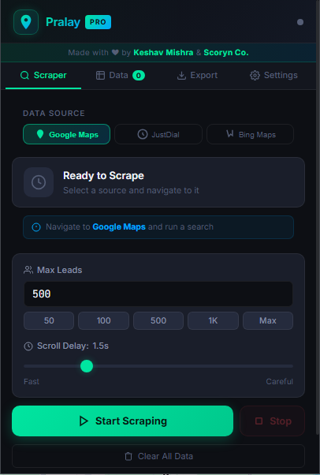
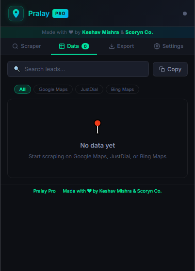
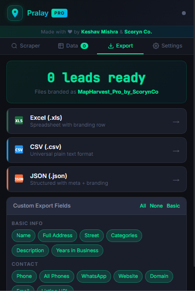
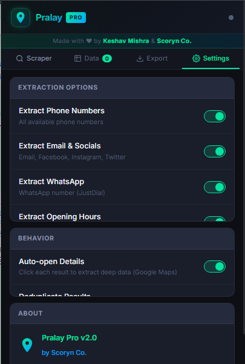

<div align="center">


# ⚡ Pralay Prospector

### Multi-Source Business Leads Scraper — Chrome Extension

[](https://github.com/millionday/pralay-prospector/releases)
[](#)
[](LICENSE)
[](#)

**Pralay Prospector** is a powerful Chrome extension that extracts business leads at scale from Google Maps, JustDial, and Bing Maps — all from a single, clean popup UI. Scrape names, phones, emails, WhatsApp numbers, ratings, addresses, social media, and more. Export to Excel, CSV, or JSON in one click.

> **"Pralay" (प्रलय)** — Sanskrit for *cataclysm*. Prospect leads at a scale that feels like a force of nature.

---

[🚀 Install](#-installation) · [✨ Features](#-features) · [📸 Screenshots](#-screenshots) · [📖 Usage](#-usage-guide) · [📦 Export](#-export-formats) · [🛠 Tech Stack](#-tech-stack) · [🤝 Contributing](#-contributing)

</div>

---

## ✨ Features

### 🌐 Multi-Source Extraction
Pralay Prospector works across **three major business listing platforms** from a single extension:

| Platform | Auto-detected | Key Fields |
|---|:---:|---|
| 🗺️ **Google Maps** | ✅ | Name, Phone, Address, Rating, Reviews, Website, Hours, Email, Social Media, Coordinates, Images |
| 📒 **JustDial** | ✅ | Name, Phone, WhatsApp, Address, Rating, Category, Email, Description, Years in Business |
| 🔷 **Bing Maps** | ✅ | Name, Phone, Address, Rating, Reviews, Website, Coordinates, Email |

### ⚙️ Core Capabilities
- **Auto-scroll** through listing pages — no manual effort
- **Real-time extraction** with live progress stats (leads extracted, scrolls, errors, elapsed time)
- **MutationObserver** for dynamic / AJAX-loaded results (JustDial infinite scroll)
- **Deep enrichment** — click each Google Maps result to extract phone, website, hours, and socials from the detail panel
- **Deduplication** — never extracts the same place twice per session
- **Configurable max leads** — 50 to 10,000 with preset buttons
- **Adjustable scroll delay** — 0.5s (fast) to 5s (careful / anti-detection)
- **Auto-export on stop** — instantly download CSV when scraping ends
- **Persistent storage** — leads survive popup close, reload anytime

### 📤 Export Formats
- **Excel (.xls)** — with branded header row
- **CSV (.csv)** — with metadata comment, universal compatibility
- **JSON (.json)** — structured output with `meta` block (author, version, timestamp)
- **Copy to clipboard** — tab-separated, paste anywhere

### 🎛️ Field Customization
Choose exactly which fields to include in your export:
- Select **All**, **None**, or **Basic** fields in one click
- Toggle individual fields per category (Contact, Location, Social Media, etc.)

---

## 📸 Screenshots

| Scraper Tab | Data Tab | Export Tab | Settings |
|---|---|---|---|
|  |  |  |  |

---

## 🚀 Installation

### Method 1 — Load Unpacked (Developer Mode)

1. **Download** the latest release ZIP from the [Releases page](https://github.com/millionday/pralay-prospector/releases)
2. **Unzip** the file to a folder on your computer
3. Open Chrome and go to `chrome://extensions`
4. Enable **Developer Mode** (toggle in the top-right corner)
5. Click **Load Unpacked**
6. Select the unzipped `pralay-prospector` folder
7. The extension icon appears in your Chrome toolbar — pin it for easy access

### Method 2 — Chrome Web Store *(Coming Soon)*
> Publication pending review. Star this repo to get notified.

---

## 📖 Usage Guide

### Google Maps
1. Go to [google.com/maps](https://maps.google.com)
2. Search for businesses (e.g. *"restaurants in Mumbai"*, *"CA firms in Delhi"*)
3. Click the Pralay Prospector icon in your toolbar
4. The extension auto-detects Google Maps and selects it as the active source
5. Set your **Max Leads** and **Scroll Delay**
6. Click **Start Scraping** — the extension auto-scrolls and extracts in real time
7. Switch to the **Data** tab to preview results
8. Go to **Export** and download in your preferred format

### JustDial
1. Go to [justdial.com](https://www.justdial.com) and run a category search (e.g. *"Electricians in Pune"*)
2. Open the extension — it auto-detects JustDial
3. Click **Start Scraping**
4. The extension uses `MutationObserver` to catch dynamically loaded cards and auto-clicks **Load More** when needed
5. Export as usual

### Bing Maps
1. Go to [bing.com/maps](https://www.bing.com/maps) and search locally
2. Open the extension — Bing Maps is auto-detected
3. Click **Start Scraping**
4. Results are extracted from the sidebar listing panel

### Tips for Best Results
- **Use specific searches** — *"plumbers in Andheri"* yields better data than *"services in Mumbai"*
- **Set scroll delay to 2–3s** on JustDial and Bing to avoid rate limiting
- **Enable Auto-open Details** (Settings) for deeper Google Maps extraction
- **Run multiple searches** and combine sessions — data persists across popup opens
- **Clear Data** before starting a new, unrelated campaign

---

## 📦 Export Formats

### CSV
```
# Pralay Prospector v2.0.0 | Made with ❤ by Keshav Mishra & Scoryn Co. | Exported: 07/06/2026
Name,Phone,Email,Website,Full Address,Avg Rating,...
"Sharma & Sons Electricals","+91 98765 43210","info@sharma.com","sharma.com","12 MG Road, Pune",4.5,...
```

### JSON
```json
{
  "meta": {
    "tool": "Pralay Prospector",
    "version": "2.0.0",
    "author": "Keshav Mishra",
    "company": "Scoryn Co.",
    "exportedAt": "2026-06-07T10:30:00.000Z",
    "totalLeads": 342
  },
  "data": [
    {
      "Name": "Sharma & Sons Electricals",
      "Phone": "+91 98765 43210",
      ...
    }
  ]
}
```

### Excel
Opens directly in Microsoft Excel or Google Sheets. First row contains a branded header with tool name, author, and export timestamp.

**All export filenames follow the pattern:**
```
Pralay_Prospector_by_ScorynCo_2026-06-07T10-30-00.csv
```


## 📋 Extracted Fields

| Field | Google Maps | JustDial | Bing Maps |
|---|:---:|:---:|:---:|
| Business Name | ✅ | ✅ | ✅ |
| Phone Number | ✅ | ✅ | ✅ |
| WhatsApp Number | — | ✅ | — |
| Email Address | ✅ | ✅ | ✅ |
| Full Address | ✅ | ✅ | ✅ |
| Street | ✅ | — | — |
| Category | ✅ | ✅ | ✅ |
| Average Rating | ✅ | ✅ | ✅ |
| Review Count | ✅ | ✅ | ✅ |
| Review URL | ✅ | — | — |
| Website | ✅ | ✅ | ✅ |
| Domain | ✅ | ✅ | — |
| Google Maps URL | ✅ | — | — |
| Listing URL | — | ✅ | ✅ |
| Latitude | ✅ | — | ✅ |
| Longitude | ✅ | — | ✅ |
| Opening Hours | ✅ | — | — |
| Featured Image | ✅ | — | — |
| Facebook | ✅ | — | — |
| Instagram | ✅ | — | — |
| Twitter / X | ✅ | — | — |
| Description | — | ✅ | — |
| Years in Business | — | ✅ | — |
| Source Platform | ✅ | ✅ | ✅ |

---

## 🛠 Tech Stack

- **Manifest V3** — Modern Chrome Extension architecture
- **Vanilla JS** — Zero dependencies in the extension itself
- **Chrome APIs used:**
  - `chrome.tabs` — query and inject into active tab
  - `chrome.scripting` — dynamic content script injection
  - `chrome.storage.local` — persistent lead storage
  - `chrome.downloads` — file export
  - `chrome.runtime.onMessage` — popup ↔ content script messaging
- **MutationObserver** — real-time detection of dynamically loaded content (JustDial)
- **DOM scraping** with multi-selector fallback chains for resilience across site layout changes

---

## ⚖️ Legal & Ethical Use

> **Please use this tool responsibly.**

- This extension is intended for **legitimate lead generation, sales prospecting, and market research**
- Always comply with the **Terms of Service** of the websites you scrape
- Do **not** use extracted data to spam, harass, or contact people without lawful basis
- In regions covered by **GDPR, PDPB (India), or similar laws**, ensure you have a valid legal basis before processing personal data
- The authors and Scoryn Co. assume **no liability** for misuse of this tool

---

## 🔄 Changelog

See [CHANGELOG.md](CHANGELOG.md) for the full version history.

**v2.0.0** — Multi-source update
- Added JustDial content script with MutationObserver support
- Added Bing Maps content script
- Auto source detection from active tab URL
- Source filter pills in Data tab
- WhatsApp, Description, Years in Business fields
- JSON export now includes `meta` block
- Source column in data table with color-coded badges

**v1.0.0** — Initial release (Google Maps only)

---

## 🤝 Contributing

Contributions are welcome! See [CONTRIBUTING.md](CONTRIBUTING.md) for guidelines.

**Ideas for future sources:**
- IndiaMART
- Sulekha
- Yellow Pages
- LinkedIn local business search
- Apple Maps

Open an [issue](https://github.com/millionday/pralay-prospector/issues) to suggest a new source or report a bug.

---

## 👨‍💻 Author

**Keshav Mishra** · [Scoryn Co.]

Made with ❤ in India 🇮🇳

---

<div align="center">

**⭐ Star this repo if Pralay Prospector saved you hours of manual work!**

[](https://github.com/millionday/pralay-prospector)

*Made with ❤ by Keshav Mishra & Scoryn Co.*

</div>
